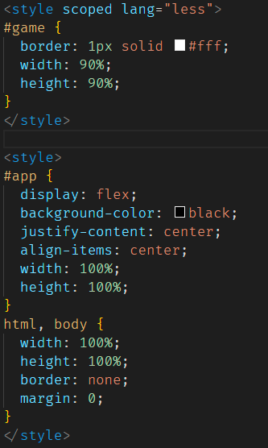
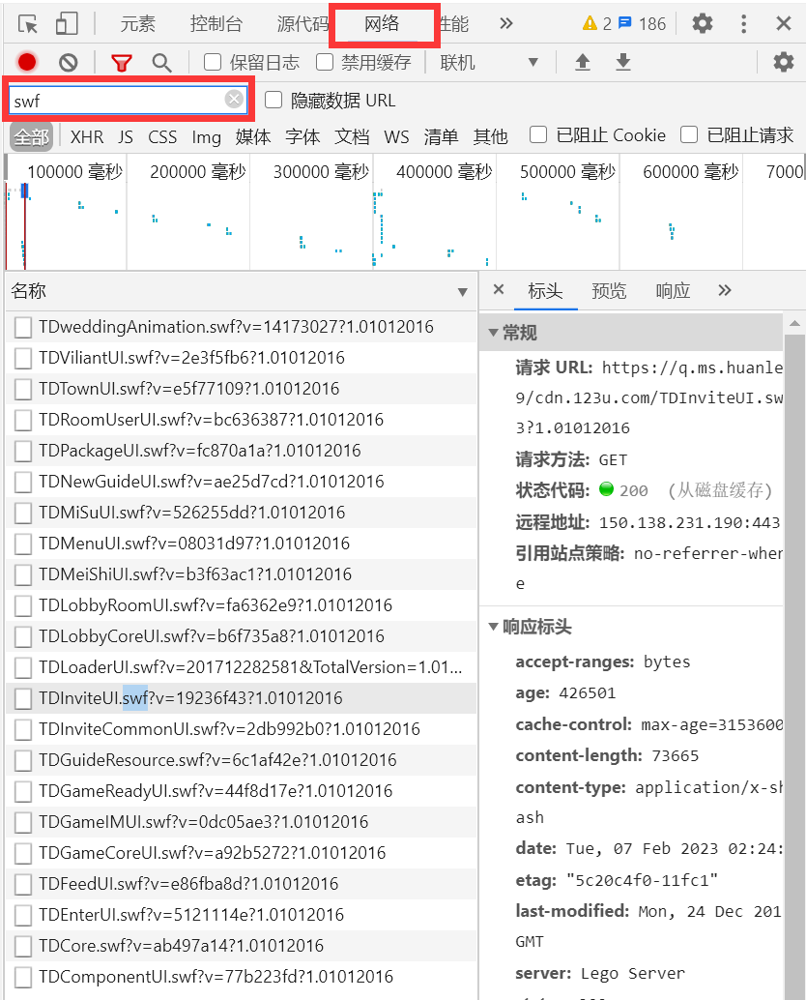

## 2022.6

为了尽可能地还原原游戏，我们需要一些手段获取到原游戏 swf 文件及其信息，方法就是使用软件 Flash Decompiler Trillix。然后我们就面临着一个严重的问题：这些素材需要我们自己拼接这就是最麻烦的地方。当然，我们也有自己的解决办法，我们可以写一个动画生成工具，当然现在还不需要。现在我们完全可以拿一张 png 格式的图片来暂时替代图片。

为了提高游戏体验，我们可以将游戏画面尽可能地做大，熟悉前端的朋友们应该意识到了，flex 布局是最佳选择。我们先搞一个 div，然后加上一些简单的 css 效果。这里我们使用 less 作为 style 语言。我们简单地写一下让游戏居中显示。

然后我们需要测量游戏画面的长宽比（吐槽一下国产浏览器太慢了），经过测量，长宽比为 16:9，那么我们可以监听页面的 resize 事件，实时让游戏画面尽可能大地显示

## 2023.2.7

下面我们需要获取游戏的图片等信息，需要用到 Flash Decompiler Trillix 对游戏的 swf 文件反编译。在支持 flash 的浏览器中，我们可以按下 F12 打开浏览器的控制台，然后选择网络，监听网络活动，然后在筛选器中输入 swf，筛选出所有的 swf 文件

## 加载界面

首先是写一个加载界面。我们将 TDLoaderUI.swf 下载下来并提取，会发现加载界面的所有的文字都是图片，这就给我们显示文字带来了很大的难度。但好在其他的地方都是可以通过图片的相互堆叠来实现。在控制台获取加载界面的背景图 loadingbg.jpg，然后使用 ai 高清修复图片高清化一下。下面我们就可以搭一个加载界面出来了。我们先来明确一下制作加载界面的步骤：

1. 绘制背景图
2. 绘制进度条
3. 绘制进度文字
4. 绘制 360 急救箱（这个真的需要吗）

显然，我们需要用 canvas 进行绘制（我不习惯用 pixi，所以没用它）。而首先，我们需要加载这几个用到的图片。那么我们就需要写一个加载系统，用来加载需要的资源。那么我们就先写一个加载类出来。首先列出来一个加载类需要的一些基础功能：

### 加载类

-   添加加载任务
-   获取加载进度，但理论上不能从外部设置，因此需要用 setter 和 getter
-   绑定加载进度的数值（由于使用了 vue，因此可以直接绑定到一个响应式变量上）
-   执行加载任务
-   监听加载是否完成

下面我们需要设计加载任务类。加载任务类应该有以下几个功能：

-   设置加载时执行的函数，或者是设置加载的地址，这里我们选择前者
-   监听任务的加载进度
-   监听任务是否加载完成
-   执行加载任务

列出所有功能后我们就可以写出 api 了。

这些函数的实现较为简单，不再列出具体实现。具体实现可以在 github 查看源码。

### 加载图片

下面是加载图片与图片缓存。我们安装 axios 依赖用来发起请求。加载一般就是加载图片和音频，因此可以针对这两个内容包装成两个函数。注意加载完毕后我们需要将它缓存起来以便后续使用。于是我们可以写出一个简易的 api 了。

这些函数的实现都比较简单，不再列出具体实现。

### 加载需要的资源

加载界面需要的图片在提取加载界面的 swf 文件时已经获得了，把这些图片放到 public 文件夹的 loading 文件夹即可。我们会发现没有“加载中”和“·”这四个字符的图片，因此就不加了，那么就直接加载剩余的图片。这些资源是需要在游戏开始前就要加载的，因此直接在 main.ts 里面写。这里我单独使用了一个 init.ts 用于初始化游戏并加载所需资源，然后使用 loadResource 函数包装了三个加载函数。这样我们便可以通过简单的调用来进行加载了。当初始资源加载完成后，我们就可以制作加载界面了。

### 制作加载界面

加载界面需要用 canvas 进行制作。我们需要拿 vue 写一个组件，这个组件需要包含一个 props，表示当前进度。绘制的时候使用 canvas2d 即可。我们使用 Flash Decompiler Trillix 把 swf 文件转换成 fla 文件，然后拿 adobe flash 打开，这样就知道了每个图片对应的位置。然后我们来进行绘制。我们发现，整个游戏的像素宽高为 950\*600（之前 16:9 算错了）。然后我们先创建一个画布，然后缩放至合适大小。然后是进行绘制。

### 绘制加载界面

由于游戏中大部分内容都是图片和文字，因此我们可以写一个简单的 canvas2d 布局系统，包含 image, imageText, text 三个绘制方法及若干功能方法。下面我们就可以使用这个布局系统绘制加载界面了。

至此，游戏的第一个界面——加载界面正式完工！

## UI 控制器

UI 控制器是游戏中一个非常重要的东西，而借助于 vue，我们可以很方便地写出一个 ui 控制器。我们使用动态组件&lt;component&gt;，使用 v-bind 来动态绑定 props，使用 v-for 来显示所有的 ui。制作完 UI 控制器后，我们便可以使用它来展示游戏中的所有的 ui 了，当然现在需要展示的加载界面也需要用它来展示。

下面，我们就进行游戏初始资源加载。

## 加载游戏信息

写完加载界面之后，下面便是进行加载了。由于我们是在线游戏，按需加载并不是一个好的选择，因为这可能会导致游戏过程中有卡顿，因此我这里就选择一次性加载所有重要内容了（这里我选择音乐、战斗地图等少部分资源按需加载，其余内容在进入游戏前加载）。

### 获取游戏的所有资源

这看起来是一项很庞大的工作，但实际上并不麻烦。同样地，我们打开控制台，然后会发现其实原游戏大部分内容都是按需加载的。不过这不是重点，我们会发现游戏进行了大量的请求来下载 swf 文件与 png 图片等，这似乎不是一个好消息，因为我们无法得知一共有多少文件。但是，既然游戏会加载这些资源，那么一定会有文件来存储需要加载的内容。因此，我们可以尝试提取所有的 swf 文件，然后全局搜索某一个文件名，看能否搜到。但遗憾的是，我们并搜索不到，或者说，能搜索到的内容跟我们想要的内容并不一样，这似乎陷入了一个很麻烦的情况。但是转念一想，需要加载的内容或许并不在 swf 文件中，而在其他文件中，于是我们可以沿着请求瀑布，在第一个请求的以 0x 开头的 swf 文件开始一个个向上寻找。不久，我们便会找到若干 xml 文件与一个名为 ConfigFilePackage.txt 的文件。xml 文件一定存储着我们需要的信息，于是我们在控制台中查看，但是信息并不完整，那么我们的目光就聚集到了这个 txt 文件中。显然，这个 txt 文件本来并不应该是一个 txt 文件，但是我们双击它之后下载，可以发现它自动把后缀名改成了 zip。于是我们就可以解压了！可能是我的软件问题，解压时显示头文件损坏，但是我们不解压而一个个地把它提取出来，这样，我们就把目前我们看到的所有的数据文件找到并下载下来了。

#### 解析 xml 文件

我们安装开发依赖 x2js，这个依赖可以将 xml 文件转为 json 文件，然后用 node 写一个工具处理即可。

#### 分析 xml 文件并找出包含的所有资源

然后我们一个个看 xml 文件，会发现 LoadFileList.xml 里面定义了很多非 0x 开头的 swf 文件，于是我们可以使用它来将所有的 swf 文件请求下来。下一步是其余的图片与 swf 文件。经过查看控制台的 swf 文件与 xml 文件，我们可以发现老鼠不仅只是一个文件，它分为两个文件，一个是在图鉴中展示的（就是游戏中等待界面下方的老鼠说明）的，一个是在游戏过程中展示的，包含老鼠受伤、被打败等动画；而美食也有类似的情况，它分为在背包与商城等地方展示的图片和在游戏中展示的卡槽中的图片两种，而攻击动画只有一种。除此之外，还有子弹、地图、情报岛中的美食与老鼠信息、角色等多个分类，大部分的 swf 文件都在 versionMD5.xml 中有定义。这里我列出所有的分类的文件取值区间：

-   图鉴老鼠：0x0001 ~ 0x1000 （0x1000-0x2000 虽然在 xml 文件中有定义，但网站上并没有这个文件）
-   子弹：0x010001 ~ 0x020000
-   火苗：0x020001 ~ 0x030000 （虽然有这么多预留，但目前还是只有两个：0x020001 和 0x020002，分别表示大火苗与小火苗）
-   战斗老鼠：0x800001 ~ 0x900000
-   战斗地图：0xE00001 ~ 0xF00000 （有三个七位的也是战斗地图，不知为何只有那三个是特例）
-   小推车（螃蟹和猫）：0x11000000 ~ 0x11001000
-   战斗美食 & 图鉴美食：0x11110001 ~ 0x12000000
-   人物衣物、武器、装备等：0x14110001 ~ 0x15000000 & 0x24D00001 ~ 0x24E00000
-   小屋：0x15D60001 ~ 0x15D70000（这个我也不知道是什么，应该是我还没解锁）

其余的是我暂时不知如何分类的东西或其他东西。

#### 请求 swf 文件

我们拿 node.js 简单地写一个请求分类代码，即可将所有的文件请求下来。

#### 搜索道具，并请求所有的道具图片

我们接着看 xml 文件，发现了一个叫做 card_desc.xml 的文件，里面包含了所有的道具说明，因此我们可以从这里下手。我们可以拿 node.js 写一个简单的请求程序，把约 10000 张图片全请求下来（真的挺多）

由于图片太多了，就不用 git 提交了。

#### 获取道具说明等信息

道具说明依然在 card_desc.xml 这个文件中，我们可以写一个工具把它转成 json。解析完之后竟然有十三万行。。

#### 获取老鼠的数据

首先是获取血量。

如果我们去翻 xml 文件的话，会发现这里面并没有老鼠的数据，只有一个 diy.xml 对应玩家作图的数据，这个并不全。那这怎么办呢？思考后其实可以想到，老鼠的数据无外乎存储在 xml 里面和 swf 里面，我们只需要都看看就行了。既然 xml 里面没有，那么就看看 swf。我们解析两个老鼠的 swf（之后会解释为什么要解析两个），然后打开它的 ActionScript 脚本。如果我们只是去读的话，我们并不能得知老鼠的生命值存在哪，因此我们需要进行搜索。这里我们使用一种在逆向工程中常用到的搜索方式。首先在 diy.xml 里面看到了平民鼠和球迷鼠的血量数据，于是我们打开平民鼠的 as 文件，全字匹配搜索 100，得到以下变量的值是 100: m_iHideLifeValue, a_1339，然后再打开球迷鼠的 as 文件，全字匹配搜索 280，只得到了一个变量 a_1339，那么这个变量就一定是我们想要的老鼠的血量变量了。我们可以拿其他的老鼠验证一下，比如铁锅鼠，diy.xml 上面的值是 660，我们搜索 a_1339，很快便找到了 660 这个数据。
